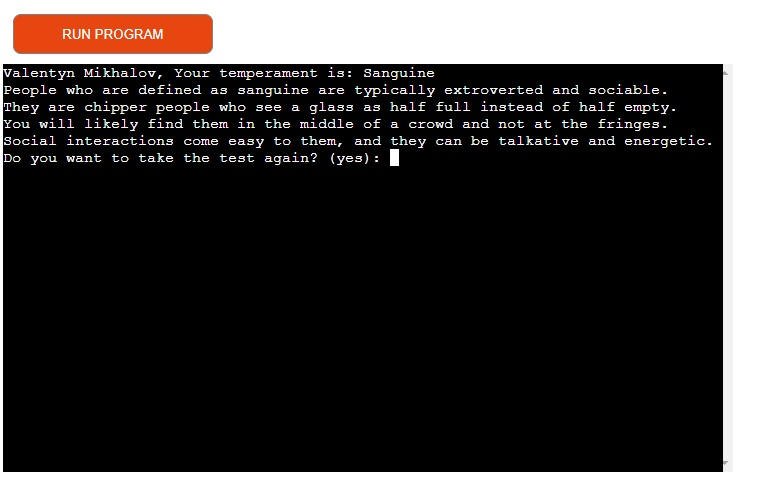

# The Temperament test

Temperament is the internal “rhythm” of a person. It affects the speed with which we react to certain situations, how strongly and intensely we experience emotions and determines our activity. Unlike character, temperament is an innate characteristic of a person. It doesn't change over time.

Link for [Temperament test](https://temperament-test-66bc018c9c9e.herokuapp.com/).

## Table of Contents

- [Project Goals](#project-goals)
- [Technologies](#Technologies)
- [User Experience - UX](#UX)
   * [User Stories](#User_Stories)
- [Features](#Features) 
- [Project diagram](#Project-diagram)
   * [Google Sheet](#Google_sheet)
- [Testing](#Testing)
   * [Manual testing](#Manual-testing)
   * [Python Validation](#Python-Validation)
   * [Bugs](#Bugs)
- [Deployment](#Deployment)
- [Credits](#Credits)

## Project Goals

The goal of the Temperament Test project is to create and implement an interactive tool that will allow users to determine their temperament type. This project aims to develop users' self-knowledge and personal effectiveness, which will ultimately contribute to their overall life satisfaction and professional success.
 

## Technologies

1. Python - programming language used for the creation of the game.
2. VSCode - was used as the primary local IDE for coding.
3. GitHub - to store the project's code.
4. Heroku - to deploy my application.
5. https://app.diagrams.net/ - creating a diagram.
6. https://www.asciiart.eu/text-to-ascii-art - weclone message.

## User Experience - UX

Custom simple and clear design, you need to enter a name (validation of entered data is used). And then 10 questions will be asked that will help determine temperament. The user is offered 4 answer options (you must enter “a”, “b”, “c” or “d”), and you can also enter zero “0” to complete the test early.

#### Key information for the site

- In a simple and understandable way, get to know yourself more.
- Simple questions and life situations.
- Clear controls with hints.
- Notifying the user about the test result, as well as additional information.

### User Stories
New site users:
- I want to easily understand how to take the test so that I can get my temperament result and detailed information.
- I want the application to be friendly
- I want clear instructions on how to answer questions.

## Features

Main functions of the project:
- Enter your username. (Checks the correctness of the input)
- Input of answers to questions is accepted only: a, b, c, d, 0. All other entered data - ask the question again.
- After answering the questions, the function determines the result based on the most selected answer option. (this is how the test is designed)
- All answers are also recorded in Google Sheets.
-If in the middle of the answer the user selected the answer “0”, then the remaining answers in the table will be recorded as “-” and the result will not be displayed.

## Project diagram

## Google Sheet

Url: [Results table](https://docs.google.com/spreadsheets/d/1BAiL0u5fYRj7r1hpuZ9WNJaa9G3JLr8MaOBxqov8h0M/edit?usp=sharing)

## Testing

### Manual testing

| Feature tested                                    | Expected outcome                                                                  | Actual outcome |
| ------------------------------------------------- | --------------------------------------------------------------------------------- | -------------- |
| Enter name - 123                                  | "Invalid name. Please enter a valid name without numbers or special characters."  | As expected.   |
| Answer №1 - 5                                     | "Invalid answer. Please choose a, b, c, d or 0." asks the question again.         | As expected.   |
| Answer №2 - fsda                                  | "Invalid answer. Please choose a, b, c, d or 0." asks the question again.         | As expected.   |
| Answer - 0                                        | "Please enter your name: " Restart app                                            | As expected.   |
| Completed all quiz                                | "{name_user}, your answers are: aaaaaaaaaa Your temperament is: Sanguine Do you want to take the test again? (yes) | As expected.   | 

### Python Validation

I validated my run.py file using [Code Institute's Python Linter](https://pep8ci.herokuapp.com/#).
There are questions about the length of lines.

### Bugs

When I ran my Code through the [PEP8](https://pep8ci.herokuapp.com/#), I found such syntax errors:

- trailing whitespace;
- continuation line under-indented for visual indent;
- expected 2 blank lines, found 1;
- line too long.

Almost all of these errors are fixed (except for the line being too long).

## Deployment

This project utilizes Heroku, a platform as a service that allows developers to create, manage, and deploy applications entirely in the cloud.

Here are the deployment steps after setting up your account:
- In the top-right corner of your Heroku Dashboard, click on New and choose Create new app from the dropdown menu.
- Ensure your app name is unique, select a region closest to you (EU or USA), and then click Create App.
- In the Settings of the newly created app, click Reveal Config Vars, set KEY to PORT, and the value to 8000, then click add.
- To support dependencies, scroll down and click Add Buildpack.
- The buildpack order is crucial. Select Python first and Node.js second. If they are not in this order, you can drag and drop them to rearrange.
- Link the GitHub repository to Heroku.

## Credits

The idea came to me when I was thinking about a project idea and decided to focus on user testing. And I decided to choose the “temperament test” because all people are interested in “who are they really?” After passing a bunch of different tests on thematic sites, I collected 10 suitable questions.
